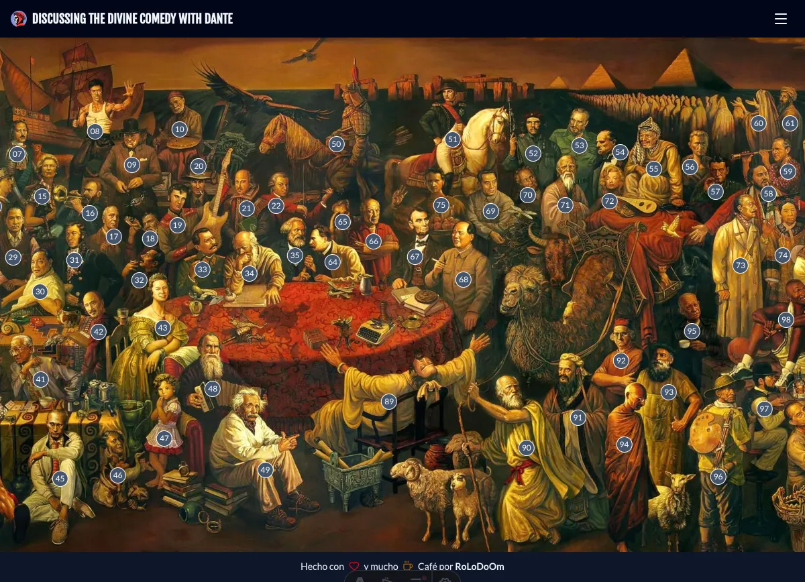

# discussing-the-divine-comedy-with-dante

An interactive guide to _Discussing the Divine Comedy with Dante_, the 2006 collaborative painting by Chinese artists Dai Dudu, Li Tiezi, and Zhang Anjun. The project lets users explore the painting and discover the more than 100 historical, cultural, and scientific figures depicted in the scene, with interactive markers, brief biographies, and links to Wikipedia for further reading. Built with Astro, Tailwind CSS, and modern web technologies.

## Status

## Preview

**[View Live Preview](https://discussing-the-divine-comedy-with-dante.netlify.app)**

## Tech Stack

- **[Astro](https://astro.build/)** - Static site builder and main framework
- **[Tailwind CSS](https://tailwindcss.com/)** - Styling and UI
- **[Prettier](https://prettier.io/)** - Code formatting and consistent code style
- **[Lucide](https://lucide.dev/)** - Open-source icon library

## Bugs and Issues

Have a bug or an issue with this template? [Open a new issue](https://github.com/rolodoom/discussing-the-divine-comedy-with-dante/issues) here on GitHub.

## License

This code is released under the [GPL-3.0](https://github.com/rolodoom/discussing-the-divine-comedy-with-dante/blob/master/LICENSE) license, which means you have the four freedoms to run, study, share, and modify the software. Any derivative work must be distributed under the same or equivalent license terms.
